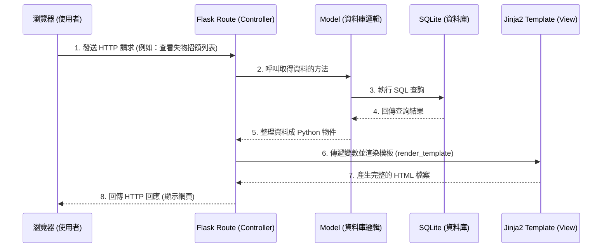

# 系統架構文件：Heart Check 校園互助與人氣回饋平台

## 1. 技術架構說明

### 選用技術與原因
- **後端框架：Flask (Python)**
  - **原因**：Flask 是一個輕量且高彈性的微型網頁框架，非常適合用於快速開發與建立 MVP。其擴充性強，能輕易結合各種資料庫與模板引擎，且學習曲線平緩，對專案開發相當友善。
- **模板引擎：Jinja2**
  - **原因**：Jinja2 是 Flask 預設且強大的模板引擎，能將後端 Python 處理好的資料直接動態渲染進 HTML 網頁中。這讓我們可以避免複雜的前後端分離架構，降低開發初期的時間成本與技術門檻。
- **資料庫：SQLite**
  - **原因**：SQLite 是一個輕量級的關聯式資料庫，不需要架設獨立的伺服器，資料儲存在單一檔案中，非常適合中小型的校園應用系統與初期開發測試。

### Flask MVC 模式說明
雖然 Flask 本身不強制規定架構，但我們採用類似 MVC (Model-View-Controller) 的設計模式來分離程式邏輯，讓專案更好維護：
- **Model (資料模型)**：負責定義資料庫的結構與處理資料的存取邏輯（例如：讀寫使用者資料、增減愛心值）。通常定義在 `app/models/` 之中。
- **View (視圖/模板)**：負責將資料呈現給使用者看的使用者介面。此部分由 HTML/CSS/JS 加上 `Jinja2` 模板組成，放置於 `app/templates/` 之中。
- **Controller (控制器/路由)**：負責接收使用者的請求（Request），從 Model 取得資料，然後將資料傳遞給 View 進行渲染，最後回傳（Response）給使用者。在 Flask 中，這由 Router (`app/routes/`) 來擔任。

---

## 2. 專案資料夾結構

本專案將採用以下結構以確保程式碼的整潔與可分工性：

```text
Heart-Check/
│
├── app/                        # 應用程式主目錄
│   ├── models/                 # Model 層：資料庫模型與邏輯
│   │   ├── __init__.py
│   │   ├── user.py             # 使用者與愛心值相關模型
│   │   ├── item.py             # 失物招領相關模型
│   │   └── announcement.py     # 宿舍與校園公告相關模型
│   │
│   ├── routes/                 # Controller 層：路由與業務邏輯
│   │   ├── __init__.py
│   │   ├── auth.py             # 註冊、登入等驗證路由
│   │   ├── user.py             # 個人檔案、QR Code、愛心值回饋路由
│   │   ├── item.py             # 失物招領相關路由
│   │   └── board.py            # 公告板與資訊相關路由
│   │
│   ├── templates/              # View 層：Jinja2 HTML 模板
│   │   ├── base.html           # 全站共用版型 (Header, Footer)
│   │   ├── auth/               # 登入、註冊相關頁面
│   │   ├── user/               # 個人檔案、QR Code 顯示與排行榜頁面
│   │   ├── item/               # 失物招領列表與內頁
│   │   └── board/              # 公告與資訊列表頁面
│   │
│   ├── static/                 # 靜態資源 (不需經過 Jinja2 渲染的檔案)
│   │   ├── css/                # 樣式表
│   │   ├── js/                 # 前端互動腳本
│   │   └── images/             # 圖片與圖示資源
│   │
│   └── __init__.py             # 初始化 Flask app (包含註冊 Blueprint)
│
├── instance/                   # 存放不進版控的執行環境檔案
│   └── database.db             # SQLite 資料庫實體檔案
│
├── docs/                       # 專案說明文件 (PRD, ARCHITECTURE 等)
│
├── config.py                   # 系統設定檔 (Secret Key, DB 路徑等)
├── requirements.txt            # Python 套件依賴清單
└── app.py                      # 程式進入點 (負責啟動伺服器)
```

---

## 3. 元件關係圖

以下圖示展示使用者在瀏覽器上的操作如何流經我們的系統架構：



---

## 4. 關鍵設計決策

1. **不採用前後端分離架構**
   - **原因**：為了在有限的開發時間內快速交付 MVP。使用 Flask + Jinja2 可以在同一個專案中處理掉前後端大部分邏輯，減少了跨來源請求 (CORS)、API 介面定義與 JSON 解析等額外負擔，適合初學者團隊快速上手。
2. **採用 SQLite 單一檔案資料庫**
   - **原因**：由於是校園專案且為初期版本，並無極高併發的需求。SQLite 不需架設與維護額外的 Database Server，且檔案易於備份與重置，能大幅提升團隊開發與測試的便利性。
3. **依據功能模組化拆分 Routes 與 Models (使用 Flask Blueprint)**
   - **原因**：避免將所有的路由與邏輯塞在同一個 `app.py` 中造成程式碼難以閱讀（義大利麵條式程式碼）。我們依功能將 `auth` (認證)、`user` (使用者)、`item` (失物招領) 拆分開來，若後續組員要分工開發，也較不容易產生程式碼衝突。
4. **行動裝置優先 (Mobile First) 的介面設計考量**
   - **原因**：本系統的核心互動「掃描 QR Code 傳送愛心值」主要依賴手機操作。因此系統雖然是網頁，但前端必須高度依賴響應式設計 (RWD)，確保在手機瀏覽器上能提供順暢的類似 App 操作體驗。
