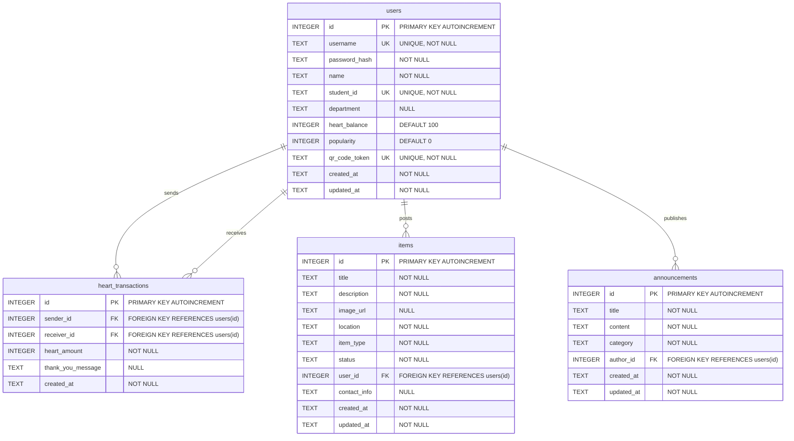

# Database Design (資料庫設計文件)

本文件定義「Heart Check 校園互助與人氣回饋平台」的資料庫 Schema、實體關係圖（ERD）以及建表 SQL。

---

## 1. 實體關係圖 (ERD)

以下是系統的實體關係圖，展示使用者、愛心交易、失物招領與公告之間的關聯：

---

## 2. 資料表詳細說明

### 2.1 users (使用者資料表)
儲存使用者的基本資訊、帳戶憑證、當前愛心值餘額、累積人氣值以及專屬的 QR Code Token。

| 欄位名稱 | 資料型別 | 主鍵/外鍵/唯一鍵 | 允許 NULL | 預設值 | 說明 |
| :--- | :--- | :--- | :--- | :--- | :--- |
| `id` | INTEGER | PK | 否 | - | 使用者唯一識別碼 (AUTOINCREMENT) |
| `username` | TEXT | UK | 否 | - | 登入帳號 (學號或自訂帳號) |
| `password_hash`| TEXT | - | 否 | - | 經過雜湊處理的密碼 (如 bcrypt) |
| `name` | TEXT | - | 否 | - | 使用者真實姓名或暱稱 |
| `student_id` | TEXT | UK | 否 | - | 學號 (用於校園身分確認) |
| `department` | TEXT | - | 是 | NULL | 科系名稱 |
| `heart_balance`| INTEGER | - | 否 | 100 | 當前剩餘可用的愛心值 |
| `popularity` | INTEGER | - | 否 | 0 | 累計獲得他人感謝的人氣值 |
| `qr_code_token`| TEXT | UK | 否 | - | 專屬 QR Code 的加密/隨機 Token，防偽造與篡改 |
| `created_at` | TEXT | - | 否 | - | 註冊時間 (ISO 8601 格式，如 `YYYY-MM-DD HH:MM:SS`) |
| `updated_at` | TEXT | - | 否 | - | 最後更新時間 (ISO 8601 格式) |

### 2.2 heart_transactions (愛心值交易紀錄表)
記錄每次受助者掃描幫助者的 QR Code 後，所產生的愛心值轉移與感謝留言。

| 欄位名稱 | 資料型別 | 主鍵/外鍵/唯一鍵 | 允許 NULL | 預設值 | 說明 |
| :--- | :--- | :--- | :--- | :--- | :--- |
| `id` | INTEGER | PK | 否 | - | 交易紀錄唯一識別碼 (AUTOINCREMENT) |
| `sender_id` | INTEGER | FK (users.id) | 否 | - | 發送愛心者 (受助者) 的使用者 ID |
| `receiver_id` | INTEGER | FK (users.id) | 否 | - | 接收愛心者 (幫助者) 的使用者 ID |
| `heart_amount` | INTEGER | - | 否 | - | 轉移的愛心值數量 |
| `thank_you_message`| TEXT | - | 是 | NULL | 感謝留言 / 說謝謝的話 |
| `created_at` | TEXT | - | 否 | - | 交易建立時間 (ISO 8601 格式) |

### 2.3 items (失物招領資料表)
記錄遺失物品（尋物啟事）或撿到物品（拾獲公告）的詳細欄位。

| 欄位名稱 | 資料型別 | 主鍵/外鍵/唯一鍵 | 允許 NULL | 預設值 | 說明 |
| :--- | :--- | :--- | :--- | :--- | :--- |
| `id` | INTEGER | PK | 否 | - | 物品唯一識別碼 (AUTOINCREMENT) |
| `title` | TEXT | - | 否 | - | 物品標題 (例如：在學餐撿到藍色皮夾) |
| `description` | TEXT | - | 否 | - | 物品詳細特徵、描述 |
| `image_url` | TEXT | - | 是 | NULL | 物品照片上傳路徑 |
| `location` | TEXT | - | 否 | - | 遺失或拾獲地點 (例如：大禮堂、二舍) |
| `item_type` | TEXT | - | 否 | - | 類型：`lost` (尋物) 或 `found` (拾獲) |
| `status` | TEXT | - | 否 | - | 狀態：`unclaimed` (未認領/協尋中) 或 `claimed` (已認領/已尋回) |
| `user_id` | INTEGER | FK (users.id) | 否 | - | 發布此公告的使用者 ID |
| `contact_info` | TEXT | - | 是 | NULL | 聯絡方式 (若不填則預設以系統內建管道聯繫) |
| `created_at` | TEXT | - | 否 | - | 發布時間 (ISO 8601 格式) |
| `updated_at` | TEXT | - | 否 | - | 最後修改時間 (ISO 8601 格式) |

### 2.4 announcements (宿舍與校園公告資料表)
記錄由管理員或幹部發布的宿舍公告與校園公告。

| 欄位名稱 | 資料型別 | 主鍵/外鍵/唯一鍵 | 允許 NULL | 預設值 | 說明 |
| :--- | :--- | :--- | :--- | :--- | :--- |
| `id` | INTEGER | PK | 否 | - | 公告唯一識別碼 (AUTOINCREMENT) |
| `title` | TEXT | - | 否 | - | 公告標題 |
| `content` | TEXT | - | 否 | - | 公告內容 |
| `category` | TEXT | - | 否 | - | 公告分類：`dorm` (宿舍) 或 `campus` (校園) |
| `author_id` | INTEGER | FK (users.id) | 否 | - | 發布公告的管理者 ID (對應 users 且具有管理者權限) |
| `created_at` | TEXT | - | 否 | - | 發布時間 (ISO 8601 格式) |
| `updated_at` | TEXT | - | 否 | - | 最後修改時間 (ISO 8601 格式) |

---

## 3. SQLite 特性與欄位設計考量

1. **時間戳記 (Timestamps)**：
   - 由於 SQLite 沒有專屬的 DATETIME 型別，我們統一使用 `TEXT` 型別，並儲存為符合 ISO 8601 格式的字串（格式為 `YYYY-MM-DD HH:MM:SS`），這樣方便在 Python 中解析並保持時區一致性，也方便直接透過 SQL 進行字串比較。
2. **唯一性約束 (Unique Constraints)**：
   - 使用者資料表的 `username`、`student_id` 與 `qr_code_token` 均設為 `UNIQUE`，以避免帳號重複、重複註冊，並確保 QR Code 識別的唯一性與安全性。
3. **外鍵約束 (Foreign Keys)**：
   - 為維護資料的完整性，系統將啟用 SQLite 的外鍵檢查（需要在連線後執行 `PRAGMA foreign_keys = ON;`）。
