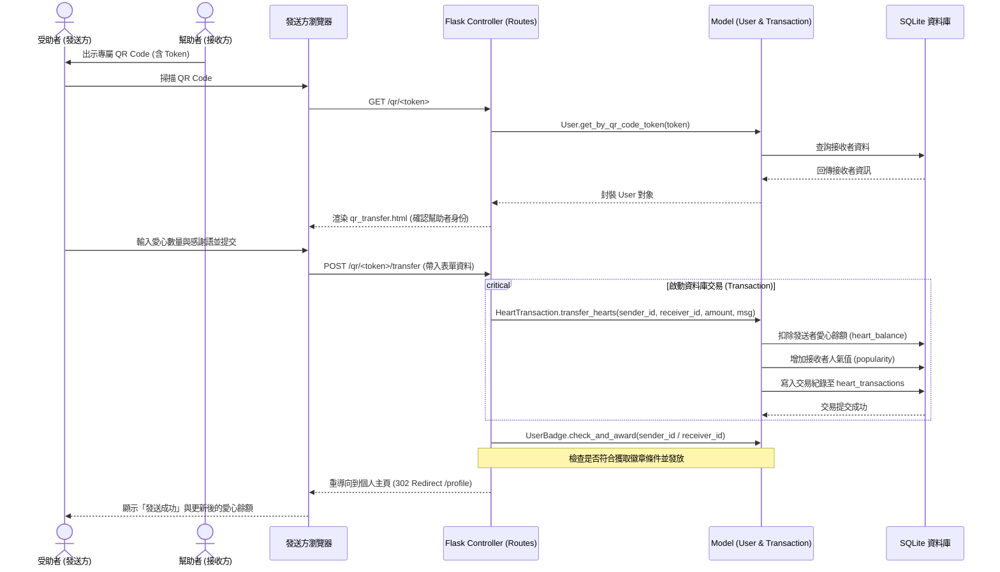

# 流程圖文件 (Flowchart)

本文件描述「Heart Check 校園互助與人氣回饋平台」的使用者操作流程、系統序列圖與核心功能對照。

## 1. 使用者流程圖（User Flow）

描述使用者進入平台後，進行註冊/登入、展示個人專屬二維碼、掃描他人二維碼進行愛心轉移，以及瀏覽佈告欄與排行榜的流程。

```mermaid
flowchart TD
  Start([開啟首頁]) --> A{是否已登入？}
  A -->|否| B[註冊 / 登入頁面]
  A -->|是| C[首頁 / 資訊大廳]
  
  B -->|登入成功| C
  
  C --> D{選擇功能模組}
  
  %% 使用者與愛心互動
  D -->|個人檔案| E[個人主頁]
  E --> E1[展示專屬二維碼]
  E --> E2[管理/釘選個人徽章]
  E --> E3[查看歷史交易紀錄]
  E --> E4[掃描他人二維碼]
  E4 --> F[填寫愛心回饋表單]
  F -->|扣除愛心/增加人氣| G([交易成功，更新餘額])
  G --> E
  
  %% 失物招領
  D -->|失物招領| H[失物清單與篩選]
  H --> H1[發布尋物/拾獲公告]
  H --> H2[查看公告詳情與聯絡]
  H --> H3[編輯/刪除/完成認領]
  
  %% 其他功能
  D -->|公告欄| I[查看宿舍/校園公告]
  D -->|求助區| J[發布與解決校園求助項目]
  D -->|排行榜| K[人氣與愛心排名 (今日/本週/本月/總榜)]
  D -->|生活資訊| L[交通時刻表與學餐餐廳評價]
```

## 2. 系統序列圖（Sequence Diagram）

描述「受助者掃描幫助者的 QR Code」並「發送愛心與感謝語」的系統技術交互流程。



## 3. 功能清單對照表

| 功能模組 | URL 路徑 | HTTP 方法 | 說明 |
| :--- | :--- | :--- | :--- |
| **首頁大廳** | `/` | `GET` | 整合顯示最新公告、協尋物品與最新善行紀錄 |
| **會員認證** | `/register`, `/login`, `/logout` | `GET / POST` | 處理使用者註冊、登入與登出 |
| **個人檔案** | `/profile` | `GET` | 顯示個人資訊、QR Code、釘選徽章與歷史紀錄 |
| **愛心轉移** | `/qr/<token>` | `GET` | 顯示向指定幫助者發送愛心值的回饋頁面 |
| **執行交易** | `/qr/<token>/transfer` | `POST` | 扣除發送方愛心，增加接收方人氣，寫入交易紀錄 |
| **感謝牆** | `/thanks` | `GET` | 公開展示所有受助者的溫馨感謝留言 |
| **排行榜** | `/leaderboard` | `GET` | 顯示人氣值最高的前 10 名使用者，支援時間篩選 |
| **失物招領** | `/items`, `/items/new`, `/items/<id>` | `GET / POST` | 瀏覽、搜尋、新增與編輯尋物/拾獲公告 |
| **求助區** | `/help`, `/help/new`, `/help/list` | `GET / POST` | 發起與回覆校園互助請求（找筆記、找組員等） |
| **生活資訊** | `/info/traffic`, `/info/restaurants` | `GET` | 提供校車時刻表與學餐餐廳評分 |

