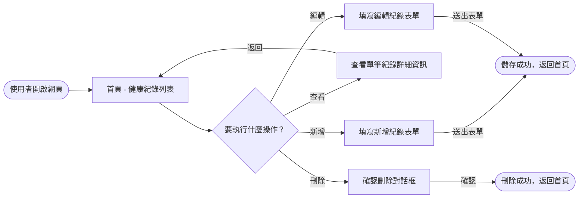
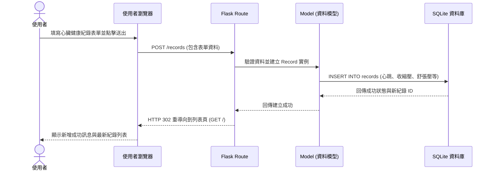

# 流程圖文件 (Flowchart)

> **說明**：由於專案中目前尚未建立 `docs/PRD.md` 與 `docs/ARCHITECTURE.md`，以下流程圖與架構是基於「Heart-Check（心臟健康管理系統）」的標準情境進行設計。系統主要提供使用者記錄心跳、血壓等健康數據，並支援完整的 CRUD（新增、讀取、更新、刪除）操作。

## 1. 使用者流程圖（User Flow）

描述使用者進入網站後，與系統互動的主要操作路徑。

## 2. 系統序列圖（Sequence Diagram）

描述「使用者點擊新增」到「資料存入資料庫」的完整技術流程。

## 3. 功能清單對照表

列出系統主要功能、對應的 URL 路徑與 HTTP 方法。

| 功能名稱 | URL 路徑 | HTTP 方法 | 說明 |
| :--- | :--- | :--- | :--- |
| **首頁 / 紀錄列表** | `/` 或 `/records` | `GET` | 顯示所有心臟健康紀錄的列表 |
| **顯示新增表單** | `/records/new` | `GET` | 顯示用於新增紀錄的 HTML 表單頁面 |
| **處理新增紀錄** | `/records` | `POST` | 接收表單資料，寫入資料庫並重導向至列表頁 |
| **查看單筆紀錄** | `/records/<id>` | `GET` | 顯示特定 ID 的紀錄詳細資訊 |
| **顯示編輯表單** | `/records/<id>/edit` | `GET` | 顯示用於編輯紀錄的 HTML 表單頁面，並帶入現有資料 |
| **處理編輯紀錄** | `/records/<id>/edit` | `POST` | 接收編輯後的表單資料，更新資料庫並重導向至列表頁 |
| **處理刪除紀錄** | `/records/<id>/delete`| `POST` | 刪除特定 ID 的紀錄，並重導向至列表頁 |
